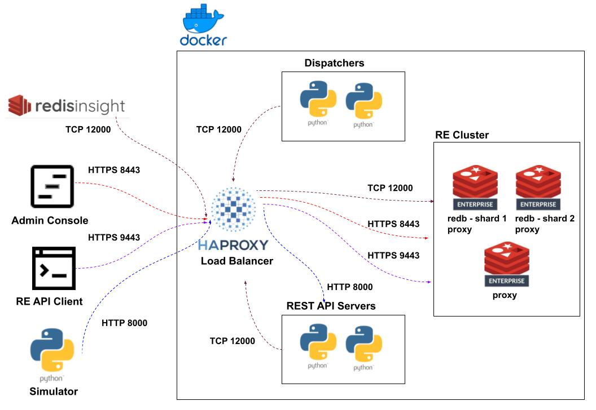

# Redis Basic ACD
## Contents
1.  [Summary](#summary)
2.  [Architecture](#architecture)
3.  [Methodology](#methodology)
4.  [Features](#features)
5.  [Prerequisites](#prerequisites)
6.  [Installation](#installation)
7.  [Usage](#usage)


## Summary <a name="summary"></a>
This is a demo of a contact center ACD application implemented with Redis.  Multiple skills and multi-skilled agents are supported.  Longest Available Agent (LAA) targeting is performed.

## Architecture <a name="architecture"></a>
  

## Methodology <a name="methodology"></a>
### Redis Data Structures
#### Contacts
Contacts are implemented as Redis JSON objects.  Each contact contains a JSON array of requisite skills.
#### Agents
Agents are implemented as Redis JSON objects.  Each agent has meta data (first and last names) and a JSON array of their skills.
#### Skills/Available Agents
Availability queues for each skill are implemented as Redis Sorted Sets.  The members of the set are available agents.  Their associated scores are a timestamp (ms) signifying when they became available.  This allows for LAA selection.
#### Queue
A universal queue is implemented as a Redis Sorted Set.  The members of the set are the keys to the contacts and their associated scores are timestamps of their entry time to queue.  This allows for multi-skill selection and FIFO handling.

### Agent Targeting
 - Available agents are placed into availability sorted sets per skill with a timestamp as their score.
 - Contacts are placed into queue implemented as a sorted set with a timestamp as their score.
 - Contacts are taken off of queue in a FIFO manner with BZIPMIN
 - Agents are targeted via ZINTER of the skill availability sets.  The Agent with the lowest score (oldest timestamp) and possessing all the requisite skills for a contact gets selected.

### Load Balancing
HAProxy is used for load balancing all client connections.
#### Rest API Server Connections - Port 8000
- HTTP round-robin load balancing across 2 servers
#### Redis Admin Console Connections - Port 8443
- HTTP least connection load balancing across 3 servers
- TLS back-to-back sessions.  A self-signed certificate is generated by the start.sh script.  That cert is used for the front-end.  The default Redis-generated cert is used on the back-end.
- 'Sticky' sessions via server cookie
#### Redis REST API Connections - Port 9443
- TCP round-robin load balancing across 3 servers
- TLS pass-thru
#### Redis Database Connections - Port 12000
- TCP round-robin load balancing across 3 servers
- Layer 7 health check via authenticated client connection w/Redis PING.
 
## Features <a name="features"></a>
- Redis Enterprise - 3 nodes with 1 database of 2 shards
- Python REST API server (FastAPI) for proxying client operations into Redis
- Redis-py async client for all ACD operations
- Redis-py dispatcher application for monitoring the ACD queue and assigning agents to contacts
- Python simulator application for generating contacts into the ACD via REST API operations
- HAProxy Load Balancing of all Redis and HTTP connections 

## Prerequisites <a name="prerequisites"></a>
- Docker
- Docker Compose
- openssl
- python3

## Installation <a name="installation"></a>
```bash
git clone https://github.com/Redislabs-Solution-Architects/basic-acd.git && cd basic-acd
pip install -r requirements.txt
```

## Usage <a name="usage"></a>
### Environment Start Up
```bash
start.sh
```

### Simulator Start Up
```bash
cd ./src && python3 simulator.py
```

### Environment Shut Down
```bash
stop.sh
```
